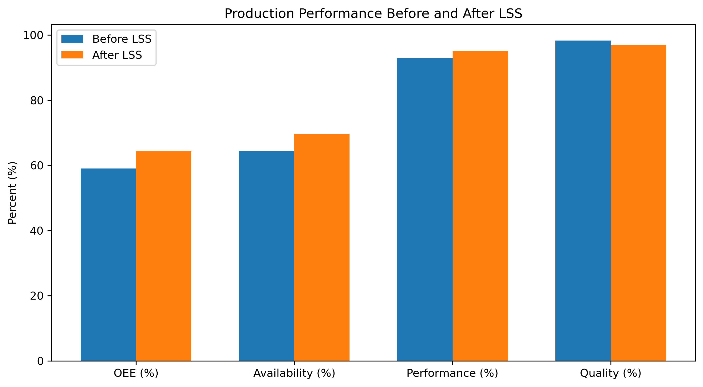
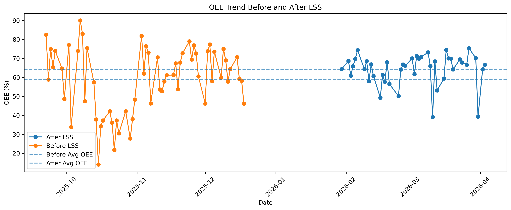
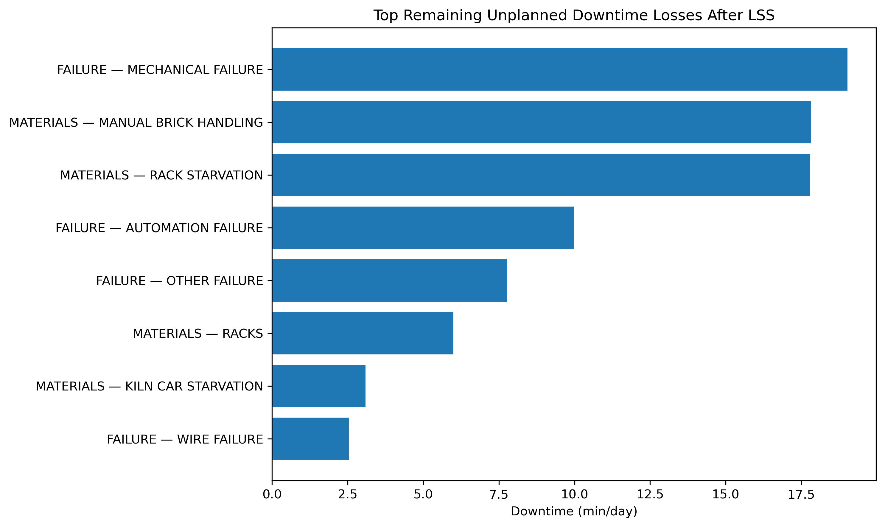

# Manufacturing OEE, Downtime & Reliability Analysis

## Overview

This project analyzes manufacturing-line performance before and after a Lean Six Sigma (LSS) improvement period.

The analysis combines OEE, downtime, and reliability metrics to identify the main sources of production loss, evaluate improvement impact, and prioritize remaining operational constraints.

## Key Results

- OEE increased from **59.1% to 64.3%** (+5.2 percentage points).
- Availability improved from **64.4% to 69.7%**.
- Performance improved from **92.9% to 95.0%**.
- Quality decreased slightly from **98.3% to 97.1%**.
- Unplanned downtime decreased from **99.7 to 95.3 min/day**.
- MTBF increased from **1.47 to 1.92 hours**.
- MTTR remained approximately unchanged at **14.6 minutes**.
- Automation Failure declined substantially after LSS.
- Rack Starvation emerged as a major new material-flow constraint.

## Production Performance



## OEE Trend



## Remaining Downtime Priorities



## Main Improvement Priorities

The post-LSS analysis identified four main areas for further improvement:

1. **Mechanical Failure** — 19.0 min/day
2. **Manual Brick Handling** — 17.8 min/day
3. **Rack Starvation** — 17.8 min/day
4. **Other Failure** — 7.8 min/day

Rack Starvation showed the strongest deterioration, increasing from approximately **1.5 to 17.8 min/day**.

## Analysis Workflow

1. Data Audit
2. OEE Performance Analysis
3. Downtime Analysis
4. Reliability Analysis
5. Root Cause Prioritization
6. Before / After Improvement Analysis

## Technologies

- Python
- pandas
- NumPy
- Matplotlib
- Jupyter Notebook

## Repository Structure

```text
manufacturing-oee-downtime-reliability/
├── data/
│   ├── raw/
│   └── processed/
├── notebooks/
│   ├── 01_data_audit.ipynb
│   ├── 02_oee_performance_analysis.ipynb
│   ├── 03_downtime_analysis.ipynb
│   ├── 04_reliability_analysis.ipynb
│   ├── 05_root_cause_prioritization.ipynb
│   └── 06_before_after_improvement_analysis.ipynb
├── outputs/
│   ├── figures/
│   └── tables/
├── README.md
├── requirements.txt
└── .gitignore